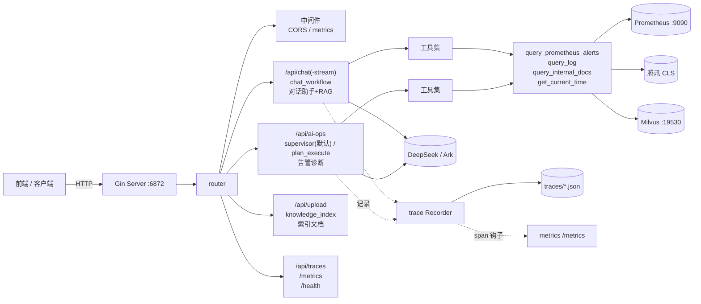
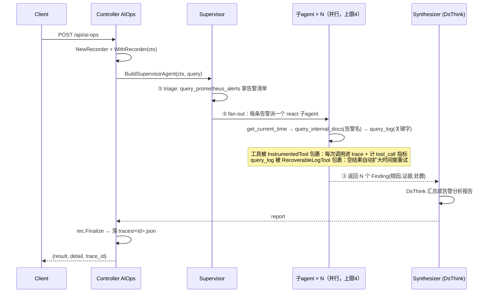
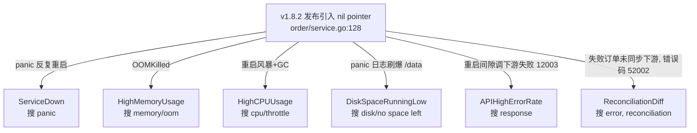
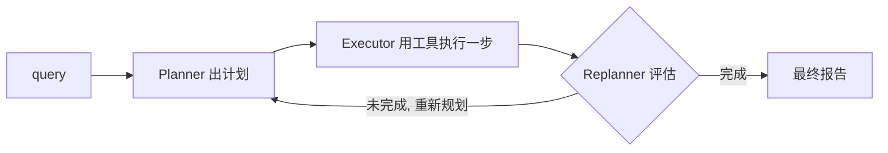

# watchTower 项目全流程说明

> 目标：让接手人 / 学习者一次性看清"这个项目是什么、怎么跑起来的、数据怎么流转、关键设计为什么这么做"。
> 配套：本地启动顺序见 `启动步骤.md`（根目录，未入 git）；变更细节见 `docs/变更说明-Agent工程化升级.md`。

---

## 一、这个项目是什么

**watchTower 是一个 AIOps 智能告警诊断 Agent**。给它一批活跃告警，它会自动完成：

```
告警 -> 查内部文档(手册) -> 按手册规定的关键字查日志 -> 解读错误码 -> 定位根因 -> 给处置策略 -> 出报告
```

典型场景（项目内置的 golden 案例）：order-service 发布 v1.8.2 引入空指针 bug，导致 6 条告警同时爆发。Agent 要能识别这 6 条告警同源于一个根因（`order/service.go:128`），而不是当成 6 个独立问题。

**技术栈**

| 层 | 选型 |
|---|---|
| 语言 | Go 1.25.7 |
| Agent 框架 | cloudwego/eino v0.8.8（组件/编排）+ eino adk（多智能体）|
| LLM | DeepSeek-v3，经火山方舟 Ark 接入。两个命名配置槽：`ds_think`（规划/汇总）、`ds_quick`（执行/子 agent）；当前 `conf.yml` 两者均指向 `deepseek-v3-2-251201`，如需区分可把 `ds_think` 换成 reasoning 模型 |
| Embedding | 豆包 doubao-embedding-vision（ark）|
| 向量库 | Milvus（库名 `agent`，集合 `biz`）|
| 日志源 | 腾讯云 CLS（直连 SearchLog API 优先 / MCP 回退）|
| 告警源 | Prometheus HTTP API `/api/v1/alerts` |
| Web | Gin |
| 业务库 | MySQL（gorm，仅 `mysql_crud` 工具用）|
| MCP | mark3labs/mcp-go（既当 CLS 客户端，也把自身工具暴露成 server）|
| 自观测 | Prometheus client_golang（自身指标）+ OpenTelemetry（可选 trace sink）|

---

## 二、整体架构



**四条 POST 路由，归为三类职责**。路由聚合在 `router/routerInit.go`（还注册 `/health`、`/metrics`、`/api/traces`），POST 定义在 `router/chatRouter.go`，真实 gin handler 在 `controller/chat/`：

| 端点 | gin handler | 底层 workflow | 干什么 |
|---|---|---|---|
| `POST /api/chat`、`/api/chat-stream` | `chat.Chat` / `chat.ChatStream` | `chat_workflow` | 通用对话助手：RAG 检索文档 + ReAct 联网/查库 |
| `POST /api/ai-ops` | `chat.AIOps` | `supervisor` 或 `plan_execute_replan` | 告警诊断，出根因+处置报告 |
| `POST /api/upload` | `chat.FileUpload` | `knowledge_index_workflow` | 上传 .md，切片+向量化+写 Milvus |

**端口速查**

| 服务 | 端口 | 说明 |
|---|---|---|
| watchTower (Gin) | 6872 | 主服务 |
| Milvus gRPC / healthz | 19530 / 9091 | 向量检索 / 健康检查 |
| mock Prometheus | 9090 | 告警源 |
| MCP server (SSE) | 9100 | `--sse :9100` |
| MySQL | 3306 | 仅 `mysql_crud` 工具用 |
| Redis（可选） | 6379 | `memory.driver=redis` 时 |

> 注：CORS 是全局中间件（`main.go` 的 `r.Use`），metrics 中间件仅作用于 `/api` 组；`/health`、`/metrics` 注册在根路由，`/api/traces` 在 `/api` 组内。

---

## 三、核心链路：告警是怎么被诊断出来的

这是整个项目最值得理解的部分。能跑通靠的是**三个数据源通过"告警名 + 关键字"对齐**：

```
Prometheus 的 alertname（英文，如 ServiceDown）
        │  必须等于
        ▼
《告警处理手册》里某小节标题含这个英文告警名  ──► 手册告诉 Agent "去搜 panic"
        │  关键字必须等于
        ▼
CLS 日志里真的有 "panic" 这个词  ──► 命中 panic 堆栈 ──► 根因 order/service.go:128
```

三者任一不对齐，链路就断：告警名对不上→查不到文档；关键字对不上→查不到日志。

### 一次诊断的完整流程（supervisor 策略）



### golden 案例的 6 告警因果链

项目 mock_data 围绕**单一根因**构造，确保 Agent 能识别"雪崩"而非 6 个独立问题：



每条告警的"搜什么关键字"写在 `knowledge/告警处理手册.md`，已被 `knowledge_cmd` 索引进 Milvus；对应日志在 `mock_data/logs/*.log`。

---

## 四、两种执行策略（`config.agent.strategy`）

| | supervisor（默认） | plan_execute |
|---|---|---|
| 编排模式 | supervisor fan-out 并行子 agent | Planner→Executor↔Replanner 状态机 |
| 告警处理 | 每条告警一个独立子 agent，**并行**（上限 4） | 单 Executor **串行**处理所有告警 |
| 工具 | 子 agent 只带 `query_log`/`query_internal_docs`/`get_current_time`（不给 alerts，避免重复抓全量） | Executor 带全部工具 |
| 模型 | 子 agent 用 `ds_quick`，汇总用 `ds_think` | Planner/Replanner 用 `ds_think`，Executor 用 `ds_quick` |
| 上界 | 子 agent `MaxStep=12` | 外层 `MaxIterations=20`，executor 内 `MaxIterations=10` |
| 适用 | 默认；并行更快，贴合"分别处理每条告警" | 回退对照；单线程 |

plan_execute_replan 的内部循环：



---

## 五、工具生态（`ai/tools/`）

所有工具都给 LLM 自动选择调用（带 jsonschema）。`ai/tools/` 下自研工具都用 eino 的 `utils.InferOptionableTool` 构造；duckduckgo 是 eino-ext 第三方工具，用 `duckduckgo.NewTextSearchTool` 直接构造。

| 工具 | 数据源 | 用于 |
|---|---|---|
| `query_prometheus_alerts` | Prometheus `/api/v1/alerts` | 拿活跃告警清单 |
| `query_log` | 腾讯 CLS（直连优先 / MCP 回退 / 都不可用则降级跳过） | 按关键字搜日志 |
| `query_internal_docs` | Milvus RAG 检索 | 查告警处理手册 / 错误码释义 |
| `get_current_time` | 系统时间 | 确定日志查询时间窗 |
| `mysql_crud` | MySQL（gorm） | 通用 SQL（仅 chat_workflow） |
| `search_file` | 本地文件系统 | 按文件名找文件（仅 chat_workflow） |
| duckduckgo | 网络 | 联网搜索（仅 chat_workflow）。*注：`google_search` 仅有配置存根、未实现* |

**关键接缝：`ToolProvider`（`ai/tools/provider.go`）**。把工具按用途分组（Log/Alerts/Docs/Time），真实链路用 `RealProvider`，**eval 用 `MockProvider`** 注入固定数据做离线确定性评估。agent 侧无感知。

---

## 六、贯穿全流程的工程能力（不是单点功能）

### 1. 评估体系（`eval/`）
让"改进"可验证。`MockProvider` 把工具结果钉死（离线），LLM 调用是真实的（被评估对象）。打分 = 确定性检查（必调工具/关键字/错误码/根因）+ LLM-as-judge（含幻觉扣分）+ 轨迹步数效率。
```bash
go run ./ai/cmd/eval_cmd            # 跑 3 个内置场景
```

### 2. 可观测性 trace（`common/trace/`）
每次 agent 运行产出一棵 span 树，落 `traces/<runID>.json`，经 `GET /api/traces/:id` 查看。`/api/ai-ops` 响应带 `trace_id`。eino callback 适配器把每个组件（模型/工具）记成 span，ChatModel span 还抓 token 用量。可选 OTel sink（`trace.enabled=true`）把 span 镜像到 `traces/otel/spans.jsonl`（自实现 file exporter，用于本地验证 OTel 链路；可替换为对接外部 collector 的 exporter）。

### 3. 自身指标（`common/metrics/`）
`GET /metrics` 暴露：`agent_run_duration_seconds`（延迟）、`agent_run_total`、`tool_call_total{tool,status}`、`llm_tokens_total{model,type}`、`deflection_observed{result}`。工具/token 计数经 trace 的 span 钩子订阅，避免 trace 反向依赖 metrics。

### 4. 会话记忆（`mem/`）
`Store` 接口：`InMemoryStore`（默认）/ `RedisStore`（`memory.driver=redis`，解决分布式一致）。可选摘要压缩（`memory.summarize=true`，历史超 2×窗口 用 LLM 压成摘要）。

### 5. Skill 路由（`ai/skills/router.go`）
按 query 向量相似度取 top-2（`defaultTopK`）个 skill 注入 prompt，不全量塞（实现原 TODO）。embedder 不可用时降级全量。

### 6. 暴露为 MCP server（`ai/mcp_server/`）
把 `query_prometheus_alerts`/`query_log`/`query_internal_docs` 打包成 MCP tools，供别的 agent / IDE（Cursor、Claude Desktop）复用。
```bash
go run ./ai/cmd/mcp_server_cmd              # stdio
go run ./ai/cmd/mcp_server_cmd --sse :9100  # SSE
```

---

## 七、关键目录结构

```
watchTower/
├─ main.go                    # 入口：config + metrics + (可选 OTel) + Gin
├─ etc/conf.yml               # 配置（模型/CLS/Prometheus/Milvus/trace/memory/agent 策略）
├─ router/                    # 路由：chat / ai-ops / upload / traces / metrics
├─ controller/chat/           # 三个入口的 HTTP 处理
├─ ai/
│  ├─ tools/                  # 工具实现 + ToolProvider 注入缝
│  ├─ skills/                 # skill 加载 + 向量路由
│  ├─ agent/
│  │  ├─ chat_workflow/       # 对话助手：RAG + ReAct（Graph 编排）
│  │  ├─ plan_execute_replan/ # 策略二：Planner-Executor-Replanner 状态机
│  │  ├─ supervisor/          # 策略一（默认）：fan-out 并行子 agent
│  │  └─ knowledge_index_workflow/  # 文档索引：切片+向量化+写 Milvus
│  ├─ mcp_server/             # 把工具暴露为 MCP server
│  └─ cmd/                    # 各 CLI：ai_ops / chat / knowledge / eval / mcp_server / llm_tool_cmd_lowLevel / recall_cmd_lowLevel（后两个为底层调试）
├─ common/
│  ├─ trace/                  # 可观测性 trace
│  ├─ metrics/                # Prometheus 自身指标
│  ├─ config/  milvus/  utils/  ...
├─ mem/                       # 会话记忆（InMemory/Redis/摘要）
├─ eval/                      # 评估体系
├─ docs/                      # 文档（告警手册/错误类型/接入指南/变更说明/specs）
├─ mock_data/                 # golden 案例：6 告警 + 4 日志 + 故障报告
├─ scripts_mockPrometheus/    # mock Prometheus :9090
├─ scripts_cls/               # 把 mock 日志上传到 CLS
└─ docker/  k8s/  deploy/     # 部署
```

---

## 八、一次完整的本地运行

```bash
# 0. 前置：.env 配好 ARK/CLS；MySQL 在跑；Docker 可用
# 1. 起 Milvus
docker compose -f docker/docker-compose.yml up -d etcd minio standalone
# 2. 索引知识库（首次/改文档才跑）
go run ./ai/cmd/knowledge_cmd
# 3. 起 mock Prometheus
go run scripts_mockPrometheus/mock_prometheus.go &
# 4. 起主服务
go run .
# 5. 触发诊断
curl -X POST http://localhost:6872/api/ai-ops
# 6. 看排查过程
curl http://localhost:6872/api/traces/<返回的 trace_id>
```

详见 `启动步骤.md`（根目录）。

---

## 九、关键设计决策（为什么这么做）

1. **ToolProvider 抽象**：让 eval 能注入 mock 工具做确定性评估，supervisor 能裁剪工具子集，真实链路无侵入。
2. **supervisor 默认 + plan_execute 回退**：并行 fan-out 更快且贴合"分别处理每条告警"，但保留单 executor 作对照与单线程场景。
3. **InstrumentedTool 包裹工具**：子 agent（react）内部工具调用默认不进 trace，靠包装把"哪个工具、入参/出参、耗时、是否报错"记进子 trace + 触发指标，并发安全。
4. **RecoverableLogTool**：query_log 空结果时自动扩大时间窗重试，而非静默降级跳过（原 executor 行为）。
5. **trace 用 context 链维护嵌套**：eino 对并行分支 fork ctx，每分支独立维护 span 栈，不串扰。
6. **请求级 recorder + 调用方持有**：controller 建 recorder、agent 记录、controller 收尾落盘，与 plan_execute/supervisor 两种策略一致。
7. **MCP 双向**：既当 CLS 客户端（回退），又把自身工具暴露成 server 给外部复用——2026 企业落地标配姿态。
